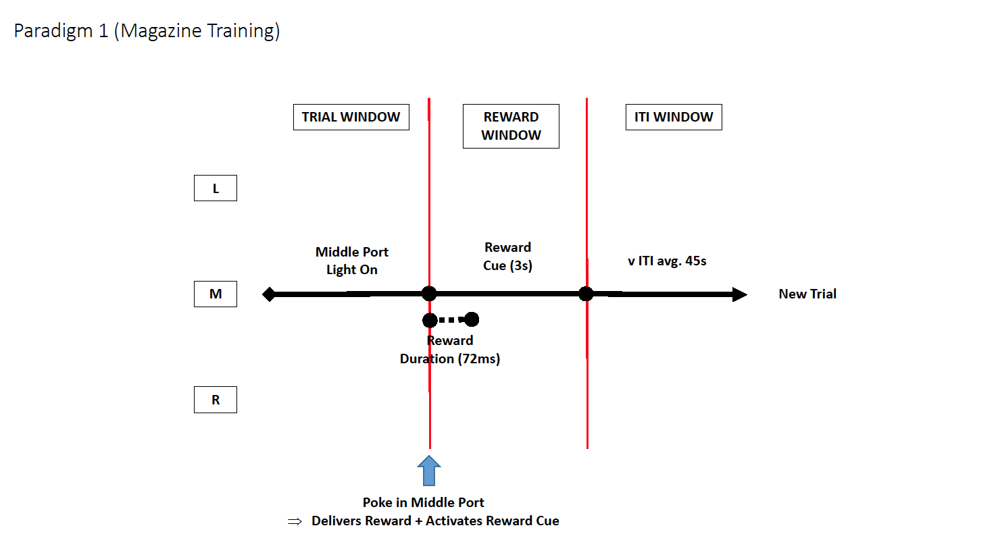

# Paradigm 1: Reward Port Training

### Simple Description

- Middle Port (Reward Port) is turned on
- Light stays on UNTIL mouse makes a correct response
- Correct Response triggers a reward and activation of reward cue
- Inter-trial Interval (ITI): variable ITI of average 45s

### Key Metrics

- Total Pokes
- Number of Correct Trials (Rewards Retrieved)
- Number of Pokes during Reward Window
- Number of Pokes during ITI window

### Logic Flow Diagram

___

   

