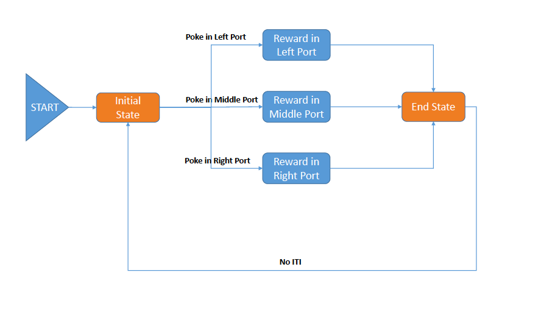

# Paradigm: Port Habituation

### Simple Description

- No cue (CS) in any of the ports
- Nosepoke triggers solenoid reward in given port

### Key Metrics

- Total Pokes
- Number of Rewards Retrieved

### Logic Flow Diagram
___

   

