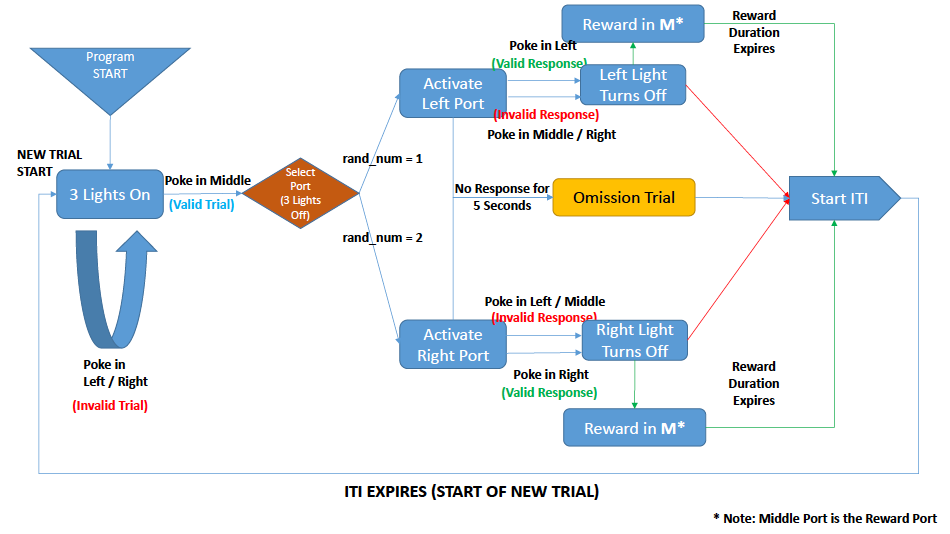

# Paradigm: Trial Initiated Reward - Part 2

### Simple Description

- All three lights on indicate trial can be initiated
- Poke in middle Port activates left or right port (pseudo-random selection)
- Valid Trial: Reward in Middle Port
- Invalid Trial: No Reward
- Introduced Trial Duration (time window when the mouse has to make a response)
- Inter-trial Interval (ITI): variable ITI of average 45s

### Key Metrics

- Total Pokes
- Incorrect Pokes before Trial Initiation
- Number of Initiated Trials
- Number of Correct Trials (Rewards Retrieved)
- Number of Incorrect Trials
- **Number of Omission Trials**
- Number of Pokes during ITI window

### Logic Flow Diagram

___

   

